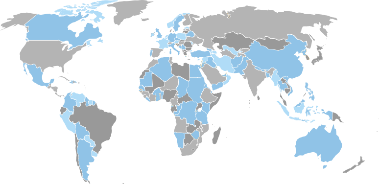

<form action="search.html" method="GET">

<label for="keywords">Keywords</label>
<input type="text" name="keywords" id="keywords" v-model="searchKeyword" placeholder="Keywords" class="form-control">

<label for="location">Location</label>
<select v-model="searchLocation" :title="getLocations" id="location" name="location" class="form-control">
<option value="" selected>Select a Location</option>
<option v-for="location in locations" :value="location"> {{ location }} </option>
</select>

<label for="searchFunctionalArea">Functional Area</label>
<select v-model="searchFunctionalArea" :title="getFunctionalAreas" id="searchFunctionalArea" name="functional_area" class="form-control">
<option value="" selected>Select a Functional Area</option>
<option v-for="area in functionalAreas" :value="area"> {{ area }} </option>
</select>

 

<button type="submit" class="btn btn-success btn-block">
Start Your Search 
</button>

</form>

<button id="close-form" class="close">

Close

&times;
</button>

<section class="global">

<h1 class="title line">Global company.  Global outlook.</h1>

Across the globe, we work together with a shared mission of helping people improve their lives. We tackle fundamental problems caused by inefficient markets, ineffective governance, and instability. We combine expertise and innovation across multiple technical sectors to deliver long-lasting results.

Click here to view DAI opportunities in different geographic areas:

</section><section class="quote-video">

<h1 class="quote">Integrity pushes everything.</h1>

Ellen, Senior Manager –  Learning & Development

Since 1970, DAI employees have worked to achieve profound and positive change in the countries and communities in which we work. Our core values are excellence, integrity, responsibility, and global citizenship. These values shape our culture and provide the basis for our success.

Our ability to innovate and implement solutions to complex problems is a direct result of our commitment to act with integrity in everything we do.

</section><section class="innovative">

<h1 class="title line">Ethical. Innovative.  Employee-owned.</h1>

DAI employees tackle some of the world’s toughest issues in some of the world’s most challenging environments. To achieve our commitment to shaping a more livable world, DAI attracts, retains, and supports the best talent in the industry. It’s written into our mission and values that we will provide our team with professional opportunities, a competitive salary and benefits package, and a healthy work-life balance.

DAI is an employee-owned company. Team members with long-term employment relationships are eligible to participate in a global employee ownership program. This allows for all employee-owners to have a personal stake in the quality and reputation of our work.

</section><section class="split-video">

<h1 class="title line">Make a lasting difference  in the world.</h1>

       
DAI delivers development solutions for a wide range of clients, across a broad range of disciplines. Over the years, our core business has grown. Today our operations include DAI’s US Government business unit, DAI Europe, DAI Global Health, and the Sustainable Business Group.

Truly global, DAI has offices in the United States, the United Kingdom, Belgium, and in projects all over the world. But no matter where we work, or what we do, DAI employees have one thing in common: we are passionate about the work we do.

DAI offers dynamic and challenging opportunities in our corporate offices and on our projects in the field for employees and independent consultants. Career options span a wide range of disciplines and functions, with diverse opportunities to learn, grow, and shape a more livable world.

<video autoplay="autoplay" loop="loop" muted>
<source src="https://s3.amazonaws.com/dai-assets/videos/split-video/home.mp4" type="video/mp4" /> 
<source src="https://s3.amazonaws.com/dai-assets/videos/split-video/home.webm" type="video/webm" /> 
Your browser does not support HTML5 video.
</video>

</section><section class="find-links">

<h1 class="title">Find your future here</h1>

DAI Careers

    <ul> 
        <li><a href="https://phf.tbe.taleo.net/phf04/ats/careers/v2/jobSearch?act=redirectCwsV2&cws=48&org=DAINC">Corporate</a></li>
        <li><a href="https://phf.tbe.taleo.net/phf04/ats/careers/v2/jobSearch?act=redirectCwsV2&cws=48&org=DAINC">Project</a></li>
        <li><a href="https://phf.tbe.taleo.net/phf04/ats/careers/v2/jobSearch?act=redirectCwsV2&cws=48&org=DAINC">Proposal</a></li>
        <li><a href="https://phf.tbe.taleo.net/phf04/ats/careers/v2/jobSearch?act=redirectCwsV2&cws=48&org=DAINC">Consulting</a></li>
    </ul>
    

</section><section class="content--full ">

<h1 class="title line">
Pioneering international  development. 
</h1>

Founded by three graduates of Harvard’s Kennedy School of Government in 1970, DAI was built on the premise that international development could be done differently… and better. That entrepreneurial and innovative spirit earned DAI a reputation as an international development pioneer.

We continue to be a forward-looking company — one that combines creative thinking, deep technical knowledge, and adroit project management. We remain as passionate, committed, and open-minded today as we were when we first opened our doors. Our multicultural, multilingual, and multidisciplinary team of more than 3,000 professionals continues to embrace opportunities to solve new problems, no matter how complex or challenging.

</section><section class="banner" style="background-image:url('assets/build/img/banner/bg-01.jpg');"></section><section class="quote-content bg-white">

                <h1 class="quote"> DAI people want their good work to make a difference. </h1>
                                    
 Tami, Director –  Information Technology 

        

        <h2 class="title"> Always Innovating </h2>
    

                
We take great pride in our company’s evolution. Ever since our founding, DAI’s story has been one of experiment and aspiration. We extended the bounds of our organization to meet a relentless drive for more enduring development solutions.
                                                                <a href="https://www.dai.com/who-we-are/history" class="btn btn-primary" target='_blank'>
Learn More 
</a>
        

</section><section class="timeline">

<h2 class="timeline--title">
Milestones
</h2>

    <h2 class='timeline-info--year'>1970</h2>
DAI founded by Don Mickelwait, Charlie Sweet, and John M. Buck, who met at the Kennedy School of Government.
<h2 class='timeline-info--year'>1973</h2>
DAI wins USAID assignment to study 36 rural development projects in Latin America and Africa.
<h2 class='timeline-info--year'>1975</h2>
Landmark study, Strategies for Small Farmer Development, published.
                            

    <h2 class='timeline-info--year'>1983</h2>
Development Management and Planning, Private Sector Development, and Agriculture and Technical Services divisions created.
<h2 class='timeline-info--year'>1985</h2>
Current CEO Jim Boomgard joins the firm, leads expansion into small and microenterprise development.
<h2 class='timeline-info--year'>1989</h2>
Worldwide GEMINI contract awarded.
                            

    <h2 class='timeline-info--year'>1995</h2>
DAI invests in U.K.-based Graham Bannock & Partners, which ultimately becomes DAI Europe.
<h2 class='timeline-info--year'>1995&nbsp;</h2>
DAI builds on long-standing profit-sharing plan by launching formal employee stock ownership plan (ESOP).
<h2 class='timeline-info--year'>1999</h2>
Tony Barclay succeeds founding CEO Don Mickelwait.
                            

    <h2 class='timeline-info--year'>2001</h2>
After 9/11, DAI's capabilities in challenging environments allow it to support critical work in Iraq, Afgahnistan, and other failed and fragile states.
<h2 class='timeline-info--year'>2006</h2>
DAI named U.S. Government Contractor of the Year.
<h2 class='timeline-info--year'>2009</h2>
Jim Boomgard succeeds Tony Barclay, launches strategy to make DAI a truly global development company.
                            

    <h2 class='timeline-info--year'>2011</h2>
DAI named one the world's Top 40 Development Innovators.
<h2 class='timeline-info--year'>2013</h2>
DAI augments U.K. operation with acquisition of distinguished British development consultancy, HTSPE.
<h2 class='timeline-info--year'>2015</h2>
DAI launches DAI Global Health, premised on tech-enabled, data-centric solutions to the health challenges of the 21st century.
                            

                

</section>